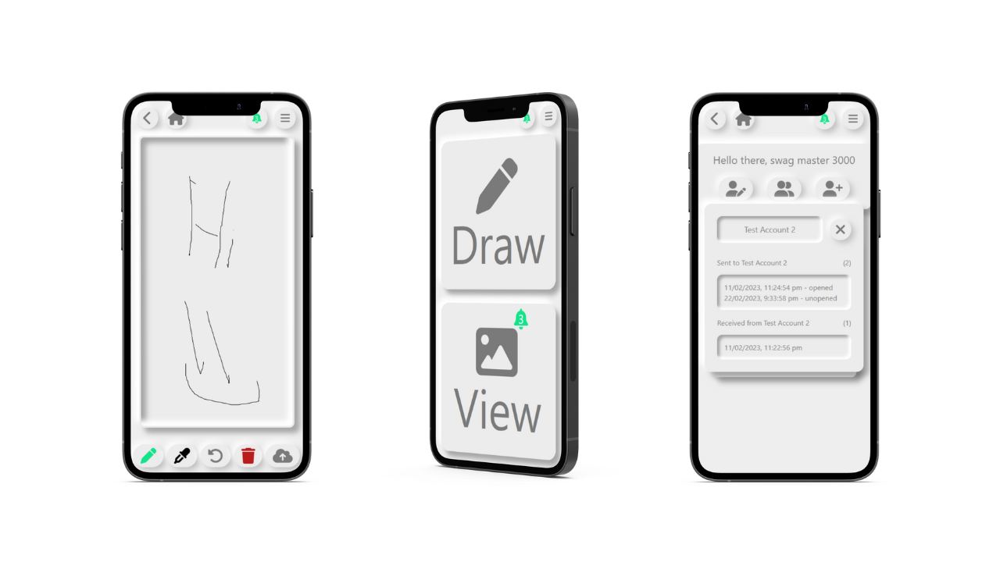

# Draw for them

[Live demo](https://drawforthem.nickleslie.dev)

Draw For Them is an ephemeral image sharing and drawing application that allows users to share their creations with other users. Built with NextJS, this application has real-time updates when users share images, add new friends, delete friends, update your profile, and view previous images sent to each other.

Head on over to https://drawforthem.nickleslie.dev to see it in action.

## Features

- [x] User Authentication through one-time code
- [x] NextJS and tRPC with WebSockets
- [x] Extensive testing of backend services
- [x] Drawing and viewing of images from other users
- [x] Expected social media features such as realtime interactions, friends, updating profile, etc.
- [x] Neumorphic design

## Development

### Tests

`pnpm tests`

Or through [Act](https://github.com/nektos/act) simply run `act`

### Dev

`pnpm dev`

### Build

`pnpm build`

## Deployment

Deployment steps are handled by [Railway](https://railway.app) but the testing pipeline is run through GitHub Actions. See [.github/workflows/test.yml](.github/workflows/test.yml)
